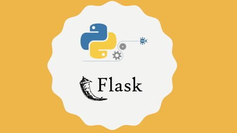

# <b><i>Знакомство с Flask!

## Home work 1<b><i>

## <b><i>Задание:<b><i>

> Создать базовый шаблон для интернет-магазина, содержащий общие элементы дизайна (шапка, меню, подвал), и дочерние шаблоны для страниц категорий товаров и отдельных товаров. Например, создать страницы «Одежда», «Обувь» и «Куртка», используя базовый шаблон.