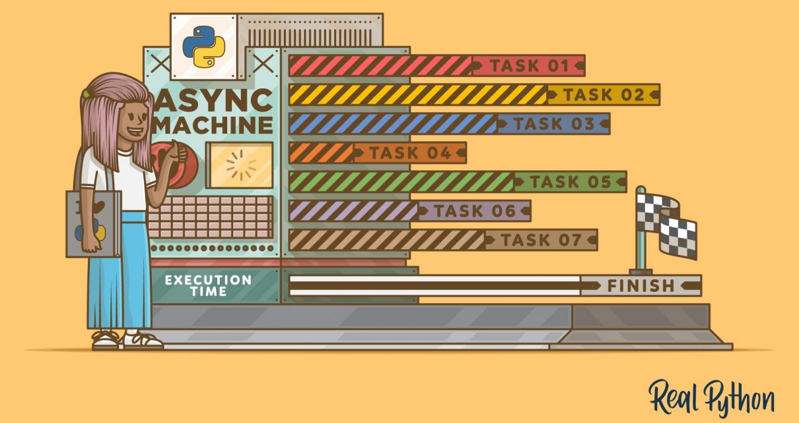

# <b><i>Фреймворки Flask и FastAPI </b></i>
## <b><i>Home work 4 (Введение в многозадачность)</b></i>

# <b><i>Задание:</b></i>
<i>
-  Написать программу, которая скачивает изображения с заданных URL-адресов и сохраняет их на диск.  - Каждое изображение должно сохраняться в отдельном файле, название которого соответствует названию изображения в URL-адресе. 
- Например, URL-адрес: https://example/images/image1.jpg -> файл на диске: image1.jpg

> 1. <b>Программа должна использовать многопоточный, многопроцессорный и асинхронный подходы.

> 2. Программа должна иметь возможность задавать список URL-адресов через аргументы командной строки.

> 3. Программа должна выводить в консоль информацию о времени скачивания каждого изображения и общем времени выполнения программы.</b>